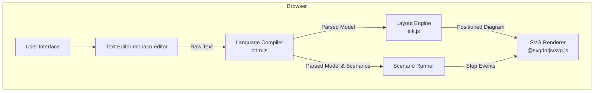
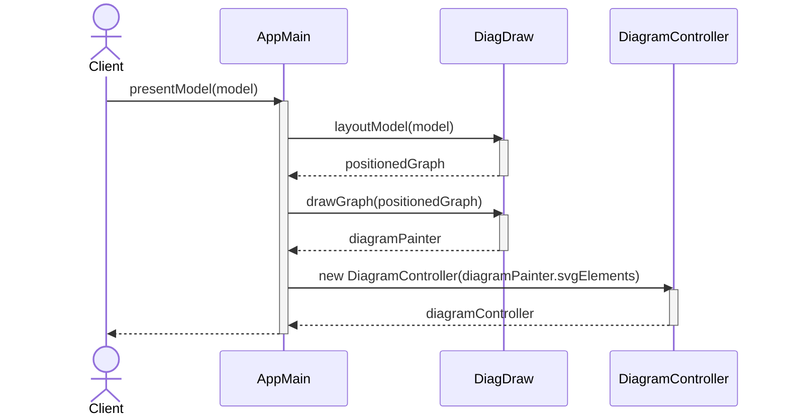
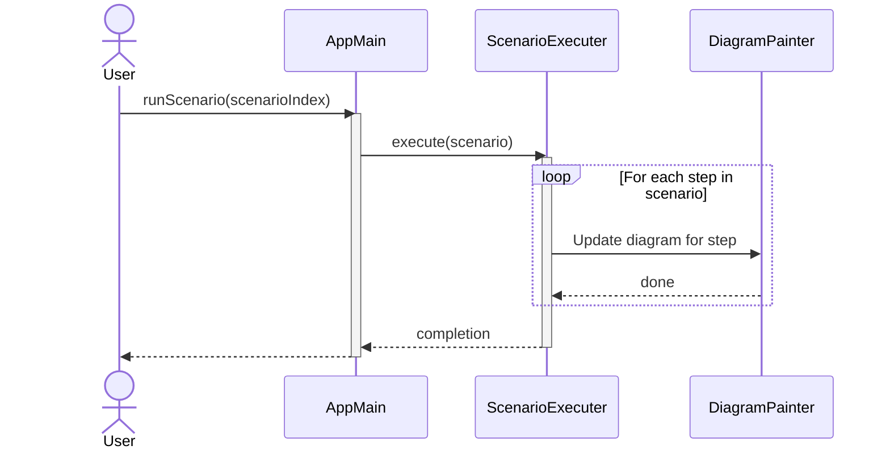

# Phase 2: Architecture Analysis

This document details the system design, component relationships, and key architectural patterns of the Scenaria application.

## 1. Overall Architecture

Scenaria is a **purely client-side application** that runs entirely in the browser. It has no backend server or database dependencies. This design choice enables zero-setup deployment and effortless sharing of entire models via URL encoding.

The application's architecture is centered around a "compiler" that processes a custom DSL. User input is parsed, laid out, and rendered into an interactive SVG diagram.

### Component Diagram

The following diagram illustrates the high-level components and the data flow between them:

## 2. Core Workflows

The application has two primary workflows orchestrated by `AppMain.js`.

### 2.1. Model Presentation Flow

This flow handles the initial rendering of the system diagram from the user's textual description.

**Trigger**: A change in the text editor.
**Orchestrator**: `AppMain.presentModel()`

**Sequence Diagram:**

**Steps**:
1.  **Parsing**: The text is first parsed by the `Lang.js` module into a `SystemModel` object.
2.  **Layout Calculation**: `DiagDraw.layoutModel()` is called, which uses the `elkjs` library (in a web worker) to calculate the optimal positions for all diagram nodes and edges.
3.  **SVG Drawing**: `DiagDraw.drawGraph()` takes the positioned graph and uses the `DiagramPainter` to render the actual SVG elements on the screen.
4.  **Interaction Setup**: A `DiagramController` is instantiated to handle user interactions like clicking or dragging elements on the rendered diagram.

### 2.2. Scenario Execution Flow

This flow executes a chosen scenario, animating the steps on the diagram.

**Trigger**: User selects a scenario and clicks "Run".
**Orchestrator**: `AppMain.runScenario()`

**Sequence Diagram:**

**Steps**:
1.  **Scenario Selection**: The user selects one of the parsed scenarios from the UI.
2.  **Execution**: `AppMain` calls the `ScenarioExecuter` with the selected scenario.
3.  **Step Loop**: The `ScenarioExecuter` iterates through each step of the scenario.
4.  **Visual Feedback**: For each step, it commands the `DiagramPainter` to apply visual changes to the diagram (e.g., highlighting an edge, showing a message). A `ScenarioStepper` can be used to pause between steps.

## 3. Key Design Patterns

-   **Compiler/Interpreter**: The core of the application is the custom language processor built with `ohm.js`. User input is parsed into a structured `SystemModel` (AST), which is the single source of truth for both diagram rendering and scenario execution.

-   **State in URL**: To achieve seamless, stateless sharing, the entire user-provided text model is encoded and stored in the URL's hash fragment. When a user shares a link, the receiving browser's application reads the state from the URL and reconstructs the exact same view. This is managed by the `src/state/State.js` module.

-   **Asynchronous Layout**: Calculating the diagram layout is a computationally expensive task. To prevent freezing the user interface, this process is delegated to a **Web Worker**. This allows the main thread to remain responsive while `elkjs` performs the layout calculation in the background. 