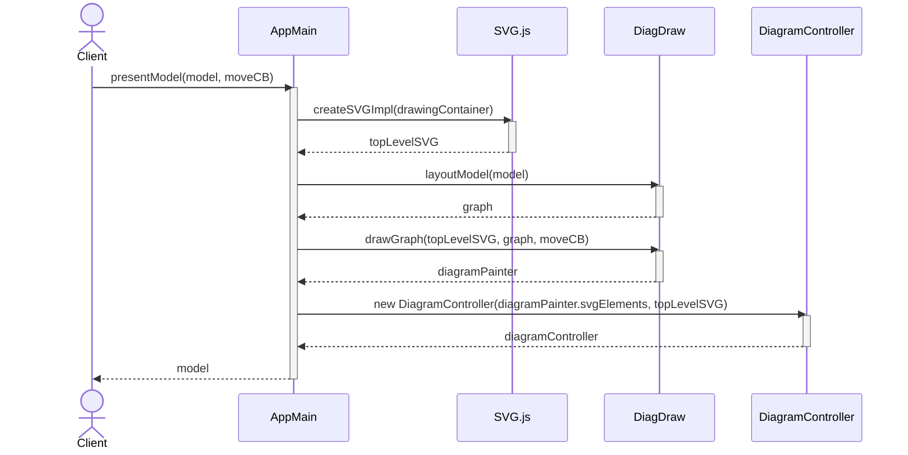

# Model Presentation Flow

This document describes the flow of presenting a model in the application, starting from the `presentModel()` function in `AppMain.js`.

## Flow

The model presentation process follows these steps:

1. The process begins when `presentModel()` is called with two parameters:
   - `model`: The data model to be presented
   - `moveCB`: An optional callback function for node movement events

2. SVG Canvas Creation:
   - Creates a new SVG canvas using `createSVGImpl()`
   - Utilizes the SVG.js library
   - Returns a `topLevelSVG` object

3. Model Layout:
   - Calls `layoutModel()` from the DiagDraw module
   - Returns a Promise with the computed graph layout
   - The graph layout is stored globally for future reference

4. Graph Drawing:
   - Calls `drawGraph()` with the SVG canvas, computed layout, and movement callback
   - Renders the visual elements
   - Returns a diagramPainter object containing SVG elements

5. Controller Setup:
   - Creates a new DiagramController instance
   - Links the SVG elements with interaction handlers
   - Stores the controller globally for future use

6. Completion:
   - Returns the original model
   - The diagram is now fully rendered and interactive

## Technical Notes

- The flow is asynchronous, implemented using Promise chains
- Global variables are used to maintain state:
  - `diagramController`: For handling diagram interactions
  - `graph`: For reference by utility functions like `showNotes()` and `hideNotes()`
- The SVG canvas (`topLevelSVG`) is also stored globally for cleanup purposes

## Related Components

- `AppMain.js`: Main orchestrator of the presentation flow
- `DiagDraw`: Handles layout and drawing operations
- `DiagramController`: Manages diagram interactions
- `SVG.js`: External library for SVG manipulation
