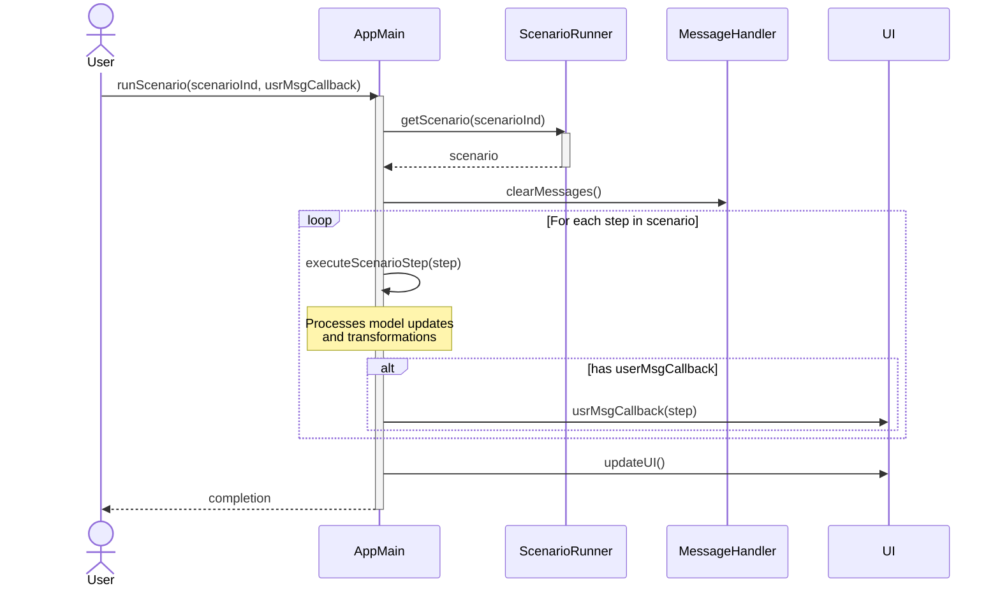

# Scenario Execution Flow

This document describes the flow of executing a scenario in the application, starting from the `runScenario()` function in `AppMain.js`.

## Flow

The scenario execution process follows these steps:

1. **Scenario Initialization**
   - Function is called with:
     - `scenarioInd`: Index of the scenario to run
     - `usrMsgCallback`: Optional callback for scenario steps

2. **Scenario Loading**
   - Retrieves the specified scenario from ScenarioRunner
   - Each scenario contains a predefined sequence of steps
   - Steps typically include model transformations and updates

3. **Message Clearing**
   - Clears any existing messages from previous runs
   - Prepares for new scenario execution

4. **Step Processing Loop**
   - For each step in the scenario:
     1. Executes the scenario step
     2. Applies necessary model transformations
     3. If provided, calls user callback with step information
     4. Updates the visual representation as needed

5. **UI Update**
   - Updates the user interface to reflect changes
   - Shows the final state after scenario execution

## Technical Notes

- The flow is synchronous
- Steps are processed sequentially
- User callback is optional and only executed if provided
- Each step may include:
  - Model modifications
  - Visual updates
  - State changes

## Related Components

- `AppMain.js`: Main orchestrator of scenario execution
- `ScenarioRunner`: Manages scenario definitions and retrieval
- `MessageHandler`: Manages message/step history
- `UI`: Handles user interface updates

## Error Handling

- Scenario execution can be interrupted if:
  - Invalid scenario index is provided
  - Step execution fails
  - Model transformation encounters an error
